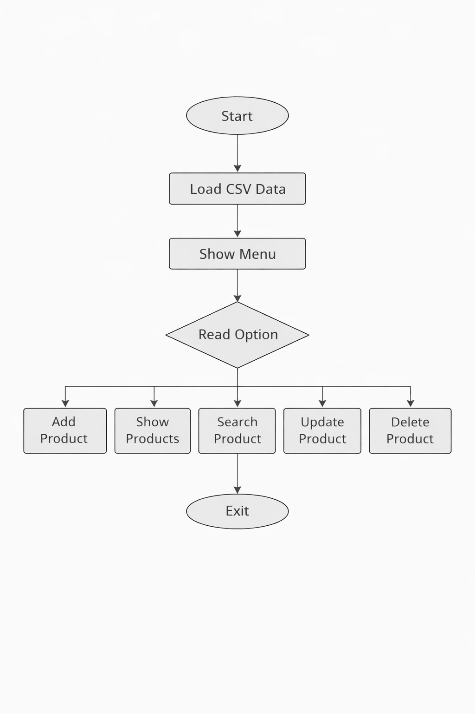

# Inventory Management System (Python CLI)

A structured Inventory Management System built with Python.
Implements CRUD operations, input validation, statistics, and CSV-based data persistence.

---

## Features

* Add new products
* View all products
* Search by ID or name
* Update product information
* Delete products
* Display inventory statistics
* Save and load data from CSV
* Input validation and error handling

---

## Project Structure

```id=
ProjectInventory/
│
├── main.py                # Entry point of the application
│
├── data/
│   └── csv_manager.py     # CSV read/write operations
│
├── source/
│   ├── functions.py       # Business logic (CRUD + statistics)
│   ├── handlers.py        # User action handlers
│   └── validations.py     # Input validation
│
├── ui/
│   └── menus.py           # CLI menus
│
├── utils/
│   └── helpers.py         # Utility functions (screen, pause)
│
├── db/
│   └── data.csv           # Persistent storage
│
└── docs/
    └── flowchart.png      # Program flow diagram
```

---

## How It Works

1. The program loads product data from a CSV file
2. Displays a menu to the user
3. Executes actions based on user input
4. Updates the in-memory product list
5. Saves changes back to the CSV file

---

## CRUD Operations

| Operation | Description                |
| --------- | -------------------------- |
| Create    | Add a new product          |
| Read      | Display all products       |
| Update    | Modify an existing product |
| Delete    | Remove a product           |

---

## Statistics

* Total units in inventory
* Total inventory value
* Most expensive product
* Product with the highest stock

---

## Technologies Used

* Python 3
* CSV module (standard library)
* Command Line Interface (CLI)

---

## How to Run

1. Clone the repository:

```bash
git clone https://github.com/your-username/ProjectInventory.git
cd ProjectInventory
```

2. Run the program:

```bash
python main.py
```

---

## Documentation

The `docs/` folder contains additional documentation:

* `flowchart.png`: Visual representation of the program logic

---
## Flowchart



---

## Design Principles

* Separation of concerns
* Modular architecture
* Clean and readable code
* Input validation
* Error handling

---

## Future Improvements

* Graphical user interface (Tkinter or PyQt)
* Database integration (SQLite or PostgreSQL)
* Logging system
* Advanced search and filtering

---

## Author

Facz
Python Developer
